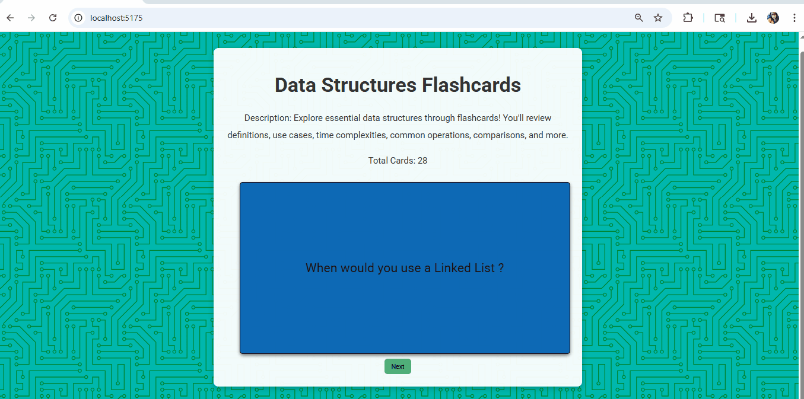

# Web Development Project 2 - *Data Structures Flashcards*
Submitted by: *Angie Rivera*

# About This Wed App
**Explore essential data structures through flashcards!**
You'll review definitions, use cases, time complexities, common operations, comparisons, and more.

Time spent: **7** hours spent in total

## Required Features

The following **required** functionality is completed:

  - [X] **The app displays the title of the card set, a short description, and the total number of cards**
    - [X] Title of card set is displayed 
    - [X] A short description of the card set is displayed 
    - [X] A list of card pairs is created
    - [X] The total number of cards in the set is displayed 
    - [X] Card set is represented as a list of card pairs (an array of dictionaries where each dictionary contains the question and answer is perfectly fine)
  - [X] **A single card at a time is displayed**
    - [X] Only one half of the information pair is displayed at a time
  - [X] **Clicking on the card flips the card over, showing the corresponding component of the information pair**
    - [X] Clicking on a card flips it over, showing the back with corresponding information 
    - [X] Clicking on a flipped card again flips it back, showing the front
  - [X] **Clicking on the next button displays a random new card**

The following **optional** features are implemented:

  - [X] Cards contain images in addition to or in place of text
  - [X] Some or all cards have images in place of or in addition to text

## Video Walkthrough

Here's a walkthrough of implemented required features:

GIF created with ...  
[ScreenToGif](https://www.screentogif.com/) for Windows

## Notes

Describe any challenges encountered while building the app.

- Flashcard Component: Creating the Flashcard.jsx component was tricky due to structuring and integrating conditional logic for displaying text or images.
- Random Card Logic: Implementing randomized card selection involved additional logic in FlashcardList.jsx.
- Styling: Choosing design elements and applying consistent CSS styling to make the flashcards visually appealing required several iterations.

### Project File Structure

| Path                              | Description                                             |
|-----------------------------------|---------------------------------------------------------|
| `src/`                            | Root source directory                                   |
| ├── `assets/`                     | Contains components, data, and image assets             |
| ├── ├── `components/`             | React components for the flashcards                     |
| ├── ├── ├── `Flashcard.jsx`       | Renders individual flashcards                           |
| ├── ├── ├── `FlashcardList.jsx`   | Manages list of flashcards and random logic             |
| ├── ├── `data/`                   | Static data used for flashcards                         |
| ├── ├── ├── `flashcard.js`        | Flashcard questions, answers, and optional images       |
| ├── ├── `images/`                 | Image assets used in cards                              |
| ├── ├── ├── `stack.png`           | Sample image used in a flashcard                        |
| ├── `App.jsx`                     | Main React App component                                |
| ├── `index.css`                   | Global styles including fonts and background            |
| ├── `main.jsx`                    | Entry point for React app                               |

## Rescoures
Design & Styling:
  - [Hero Patterns](https://heropatterns.com/) for Background used : Circuit Board
  -  [Google Font](https://fonts.google.com/) for Font used : Roboto

## Development Tools
- React — UI library for building reusable components
- Vite — Build tool for faster React setup
- VS Code — Code editor used
  
## License

    Copyright [2025] [Angie Rivera]
    Licensed under the Apache License, Version 2.0 (the "License");
    you may not use this file except in compliance with the License.
    You may obtain a copy of the License at

    http://www.apache.org/licenses/LICENSE-2.0

    Unless required by applicable law or agreed to in writing,
    software distributed under the License is distributed on an
    "AS IS" BASIS, WITHOUT WARRANTIES OR CONDITIONS OF ANY KIND,
    either express or implied. See the License for the specific
    language governing permissions and limitations under the License.
