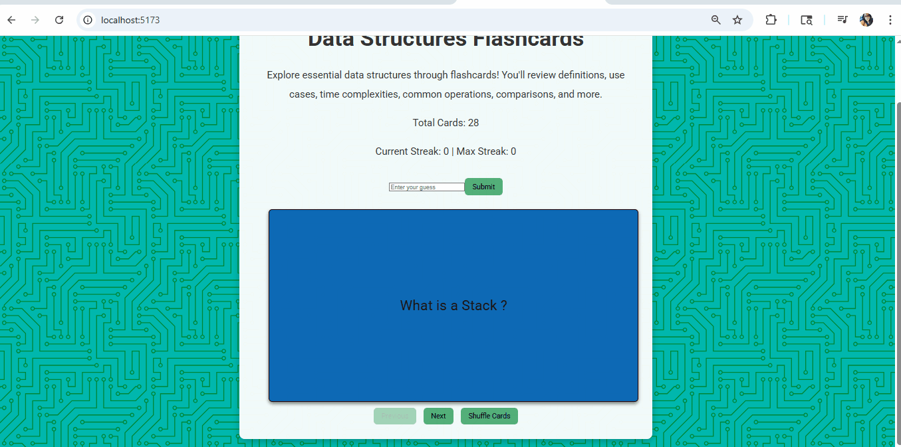

# Web Development Project 2 - *Data Structures Flashcards*
Submitted by: *Angie Rivera*

# About This Wed App
**Explore essential data structures through flashcards!**
You'll review definitions, use cases, time complexities, common operations, comparisons, and more.

Time spent: **6** hours spent in total

## Required Features

The following **required** functionality is completed:

## Required Features

The following **required** functionality is completed:

- [X] **The user can enter their guess into an input box *before* seeing the flipside of the card**
  - Application features a clearly labeled input box with a submit button where users can type in a guess
  - Clicking on the submit button with an **incorrect** answer shows visual feedback that it is wrong 
  - Clicking on the submit button with a **correct** answer shows visual feedback that it is correct
- [X] **The user can navigate through an ordered list of cardss**
  - A forward/next button displayed on the card navigates to the next card in a set sequence when clicked
  - A previous/back button displayed on the card returns to the previous card in the set sequence when clicked
  - Both the next and back buttons should have some visual indication that the user is at the beginning or end of the list (for example, graying out and no longer being available to click), not allowing for wrap-around navigation

The following **optional** features are implemented:

- [X] **Users can use a shuffle button to randomize the order of the cards**
  - Cards should remain in the same sequence (**NOT** randomized) unless the shuffle button is clicked 
  - Cards should change to a random sequence once the shuffle button is clicked
- [X] **A user’s answer may be counted as correct even when it is slightly different from the target answer**
  - Answers are considered correct even if they only partially match the answer on the card 
  - Examples: ignoring uppercase/lowercase discrepancies, ignoring punctuation discrepancies, matching only for a particular part of the answer rather than the whole answer
- [X] **A counter displays the user’s current and longest streak of correct responses**
  - The current counter increments when a user guesses an answer correctly
  - The current counter resets to 0 when a user guesses an answer incorrectly
  - A separate counter tracks the longest streak, updating if the value of the current streak counter exceeds the value of the longest streak counter 

## Video Walkthrough

Here's a walkthrough of implemented required features:

GIF created with ...  
[ScreenToGif](https://www.screentogif.com/) for Windows

## Notes

Describe any challenges encountered while building the app.

- Flashcard Component: Creating the Flashcard.jsx component was tricky due to structuring and integrating conditional logic for displaying text or images.
- Random Card Logic: Implementing randomized card selection involved additional logic in FlashcardList.jsx.
- Styling: Choosing design elements and applying consistent CSS styling to make the flashcards visually appealing required several iterations.
- Shuffling cards
- setting up an input box with no text limit
- making sure case characters didn't matter
- making sure the respones was giving correct or incorrect based on the answer text 

### Project File Structure

| Path                              | Description                                             |
|-----------------------------------|---------------------------------------------------------|
| `src/`                            | Root source directory                                   |
| ├── `assets/`                     | Contains components, data, and image assets             |
| ├── ├── `components/`             | React components for the flashcards                     |
| ├── ├── ├── `Flashcard.jsx`       | Renders individual flashcards                           |
| ├── ├── ├── `FlashcardList.jsx`   | Manages list of flashcards and random logic             |
| ├── ├── `data/`                   | Static data used for flashcards                         |
| ├── ├── ├── `flashcard.js`        | Flashcard questions, answers, and optional images       |
| ├── ├── `images/`                 | Image assets used in cards                              |
| ├── ├── ├── `stack.png`           | Sample image used in a flashcard                        |
| ├── `App.jsx`                     | Main React App component                                |
| ├── `index.css`                   | Global styles including fonts and background            |
| ├── `main.jsx`                    | Entry point for React app                               |

## Rescoures
Design & Styling:
  - [Hero Patterns](https://heropatterns.com/) for Background used : Circuit Board
  -  [Google Font](https://fonts.google.com/) for Font used : Roboto

## Development Tools
- React — UI library for building reusable components
- Vite — Build tool for faster React setup
- VS Code — Code editor used
  
## License

    Copyright [2025] [Angie Rivera]
    Licensed under the Apache License, Version 2.0 (the "License");
    you may not use this file except in compliance with the License.
    You may obtain a copy of the License at

    http://www.apache.org/licenses/LICENSE-2.0

    Unless required by applicable law or agreed to in writing,
    software distributed under the License is distributed on an
    "AS IS" BASIS, WITHOUT WARRANTIES OR CONDITIONS OF ANY KIND,
    either express or implied. See the License for the specific
    language governing permissions and limitations under the License.
